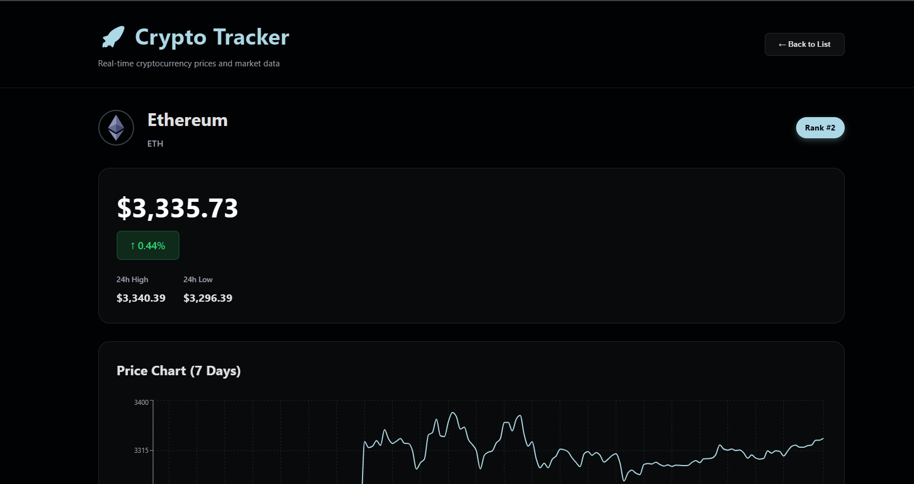

# CryptoPulse – Real-Time Crypto Dashboard

CryptoPulse is a web application that fetches real-time cryptocurrency market data using public APIs and displays prices, market trends, and key metrics through a clean and responsive user interface.

---

## Project Preview





---

##  Features
- Cryptocurrency price tracking
- Responsive and user-friendly UI
- Fast and lightweight frontend

---

## Tech Stack
- React.js  
- JavaScript  
- REST APIs  
- HTML & CSS  

---
##  Getting Started
```bash
npm install
npm run dev
```
## Use Case

Track cryptocurrency prices and market trends in real time through a simple and intuitive dashboard.
